<h1 align = "center">TravelGo!</h1>
<h3 align = "center">Team 11   Aník van Deursen, Riya Gupta, Radha Mujumdar, Diana Todoran</h3>
<h3 align = "center">GitLab Repository: [https://gitlab.ewi.tudelft.nl/cs4505/2025-2026/team-11](https://gitlab.ewi.tudelft.nl/cs4505/2025-2026/team-11)</h3>

## 1 Introduction

### 1.1 Problem Statement
Travelling is widely regarded as an enriching experience that allows individuals to explore new places, engage with diverse cultures, and participate in the social life of a destination. However, travelers often face considerable challenges. Limited time can make it difficult to fully engage with the abundance of culture and history, and often makes it impossible to visit all tourist attractions.

Another challenge lies in connecting with other travelers. Tourist, especially those travelling alone, can face difficulties in finding like-minded individuals. Because of this they might not create meaningful connections during their travels, which can limit the overall enjoyment of their experience.

### 1.2 Context & purpose
To address these challenges, we want to create an interactive digital platform that makes travelling easier and more enjoyable for both group and solo travelers across various countries: TravelGo. Central to the platform is a map with all of the tourist attractions, including hidden spots. The platform aims to enrich cultural engagement with competitive games (for example quiz competitions) with a reward system through leaderboards. To make this competition enjoyable for both inexperienced and experienced travelers, the platform uses a rating system with leagues. Users can additionally earn points by going to an attraction and thus ticking it off their bucket list. These points can be used to for example get a discount on entry fees or to get an exclusive souvenir.

Another main part of TravelGo is making it easier for travelers to engage with each other. To encourage tourist interaction, the platform will include a chatroom. This chatroom helps travelers to meet new people that are at the same location. Users can also post new or hidden attractions that they recommend to others. Because of this, tourist will know which attractions will be the most worthwhile to visit.

## 2 Market Research

To identify opportunities for innovation, it is useful to examine the existing players in the travel tech market. The table below presents a comparative analysis of these competitors, outlining their strengths, weaknesses, and potential gaps.

| Serial No. | Competitor | Strengths | Weaknesses | Opportunity for us |
|--------|------------|-----------|------------|---------------------|
| 1 | **TripRanger** | Gamifies travel, fun challenges | Limited user base, not mainstream, focus mostly on gamification rather than deep cultural immersion | We can combine interactivity and cultural depth, making it more meaningful |
| 2 | **Polarsteps** | Very popular, creates a visual travel journal, great for reliving your travel experiences. Helps share trips with friends and family | Mostly passive (recording, not interacting); limited social engagement beyond sharing | We add interactivity, side quests, community building |
| 3 | **Withlocals** | Popular; focused on authentic cultural experiences by connecting with locals/guides | Paid/expensive; depends heavily on guide availability; no gamification or community | Make authentic culture accessible and community driven |
| 4 | **Viator** | Huge catalog of tours & activities | Overly commercial and not personalised, lacks interactive features | Focus on personalised, fun challenges and cultural immersion rather than generic tours |
| 5 | **Komoot** | Expertise in outdoor navigation and route planning | Very niche (outdoors only) | Add cultural challenges with a social community |
| 6 | **Mapstr** | Save and share favourite places easily | More like a utility app (maps), lacks engagement, no gamification | Build on map sharing, but with interactive quests, culture and competition |  
| 7 | **Google Maps** | Massively popular for navigation, locating places | Lacks the interactive aspect | We add interactivity and cultural immersion |  

Table 1: Competitor Analysis

### 2.1 Key Insights

#### Is there demand?  
Market trends indicate that travellers increasingly seek experiences over mere sightseeing. Therefore, platforms that are interactive and community-driven are especially popular among younger travellers nowadays [[2]](#2)[[3]](#3)[[4]](#4).

#### What’s missing in current solutions?  
- Most travel apps focus on either utility (planning, booking) or authenticity (guided tours).  
- Few apps combine an interactive, culturally immersive experience with community building.  
- Existing solutions often lack interactivity, offline usability, or gamified side quests.  

#### How TravelGo fills that gap  
- Integrates interactive, culturally immersive experiences with community engagement into a single platform.  
- Enables users to complete side quests, join challenges, and earn rewards while exploring off-beat locations.  
- Promotes social discovery by connecting travellers nearby.

## 3 Wardley Map
Building on the system’s vision and context, the Wardley Map highlights how TravelGo blends innovation with open source or standardised solutions.

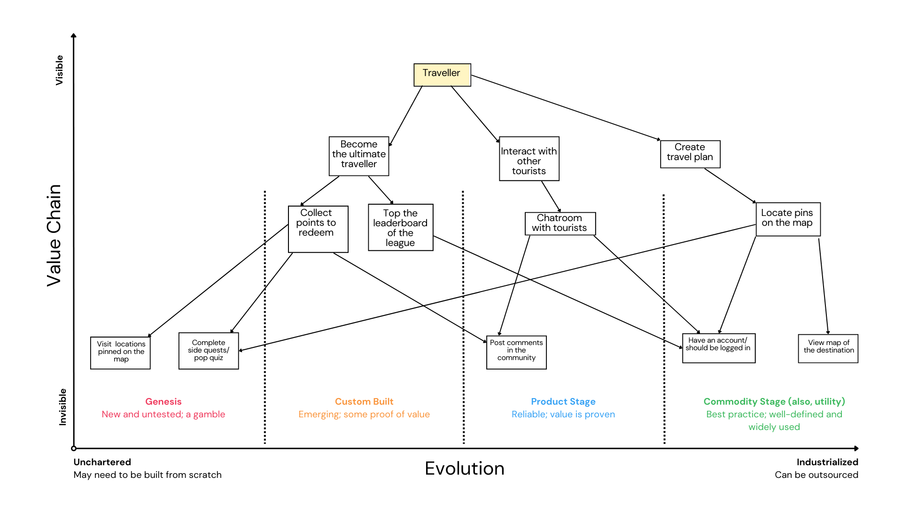

Figure 1: Wardley map

**Genesis** : This space contains novel, experimental features like side quests, cultural quizzes and souvenir based rewards which are not yet mainstream in the travel tech domain. They provide differentiation, but also present a high risk of adoption and design.  
**Custom Built**: Features like leaderboards and points system are placed here. While interactive platforms are popular in other domains like fitness and education, applying it specifically to cultural travel remains relatively bespoke. These features distinguish TravelGo from commodity travel apps but are less risky than Genesis elements.  
**Product Stage**: More well known features such as community chatrooms and posting comments fall under this category. These are standard capabilities available in many social or booking apps, but TravelGo customises them for cultural travel contexts. They are visible to users but do not offer radical innovation.  
**Commodity Stage**: Underlying infrastructure such as digital maps, location pinning, user accounts and APIs are considered commodity. They are invisible to end-users and widely available through third-party providers like Google Maps. TravelGo does not attempt to innovate here but instead rely on stable, low-cost services.  

## 4 Challenges

**I. Data Privacy & Trust** : Data privacy and trust are critical concerns for TravelGo, as the platform collects personal information such as names, locations, and travel history. Mishandling this data could result in legal issues and a loss of customer trust. However, several ambiguities arise, such as determining how much data should be collected, finding the right balance between personalisation and privacy, and managing cross-border compliance. From an architectural perspective, the system must implement data minimisation by collecting only what is necessary, incorporate strong consent management, and ensure secure data storage and transmission. Additionally, regional data hosting may be required to meet compliance regulations.

**II. Cultural Sensitivity & Representation** : TravelGo promotes cultural quests and hidden gems, but what one traveller considers a “hidden gem” could, in fact, be a sacred site or a sensitive local tradition. Such misrepresentation risks community backlash and even legal consequences. This raises ambiguities around who decides what is “authentic” enough to feature and how to avoid cultural appropriation or trivialisation. Architecturally, the platform may require robust content vetting workflows, potentially involving local validators or approval pipelines for sensitive submissions. Flexible data models will also be needed to support metadata tagging of cultural content such as marking items as sensitive, sacred, or family-friendly, along with the ability to enable regional customisation where necessary.

**III. Technical Constraints** : Travellers often face unreliable connectivity, yet TravelGo’s core features such as locating pins, chat, and quests may rely heavily on online services. This raises ambiguities around which features should remain functional offline and how much data can reasonably be cached on a device without draining storage or battery. Through an architectural lens, the system may need to adopt an offline-first design, ensuring that critical functions remain usable without constant connectivity. In particular, GPS tracking without internet access would depend on operating system support and offline map APIs.

**IV. Community Moderation & Safety** : TravelGo’s chatrooms and commenting features are central to its social experience, but like most online community spaces, they can quickly become targets for spam, harassment, scams, or inappropriate content. This introduces ambiguities around whether moderation should rely on AI and keyword blocking or be led by human moderators, how to enforce community rules across diverse cultures and languages, and whether moderation should be centralised or distributed. From a design point of view, this creates the need for scalable content moderation pipelines, along with careful handling of flagged content since its storage and processing bring compliance and legal liabilities. At the same time, balancing low latency for real-time chat with effective filtering poses significant technical challenges.

**V. Ecosystem Dependencies** : TravelGo relies on third-party APIs for critical functionalities such as maps and login, but this dependency introduces several uncertainties. Providers may change pricing models, discontinue services, or have limited availability in certain regions. This raises the question of whether to design for multi-provider fallback or accept the risks of locking into a single provider. From an architectural standpoint, it becomes important to introduce abstraction layers rather than hardcoding to any one API, consider vendor diversity to reduce reliance on a single source, and actively monitor latency and reliability across providers to ensure a consistent user experience.

## 5 Stakeholders

Travellers create demand by seeking personalisation and meaningful connections, gravitating toward the cultural, recreational, and community-driven offerings available on the platform. They engage with attraction sites and redeem discounts at local businesses, boosting visitor numbers and generating higher revenue for these stakeholders while promoting their trade. Management works closely with regulatory authorities and tourism boards to ensure compliance and safety. Strengthening the platform’s visibility, travel communities and influencers amplify positive experiences through information sharing and marketing. Together, TravelGo delivers reliable, user-centric travel solutions while balancing the needs of customers, local communities, and the broader ecosystem.

### 5.1 Primary Stakeholders

- Tourists and Travellers
  - Main users of the platform
  - Engage in competitive games, meet like-minded individuals and be interested in cultural enrichment
- Attraction Sites
  -  Higher footfalls and visitor engagement resulting in an increase in ticket sales
-  Local Businesses
   -  Advertisements and partnerships will gain more exposure, eliciting profits
   -  Support special offers and discounts

### 5.2 Secondary Stakeholders

- Government and Tourism Boards
  - Boost in tourism while ensuring compliance of the local laws
  - Control the digital platforms, tourism, and safeguarding the cultural
- Local Communities
  -  Cultural representatives who gain from more interactions and business from tourists
  -  Might be worried about cultural sensitivity
-  Investors and Sponsors
   -  Support financially and expecting returns in the form of partnerships, advertisements, subscriptions, and even positive publicity
  
### 5.3 Tertiary Stakeholders

- Travel Agencies and Tour Operators
  - Competitors or can be potential partners
- Online Travel Communities and Influencers
  - Increase online engagement and positive word of mouth through social media 

 

The power/interest grid in Figure 2, is used to classify stakeholders according to their influence and level of engagement. High-power, high-interest stakeholders such as travellers and attraction owners are closely managed since they are the core users. Tourism boards and regulators have high power but lower day-to-day interest, requiring consultation occasionally. Communities, influencers, and competitors have lower power but varying levels of interest, monitored for promotion and market positioning.

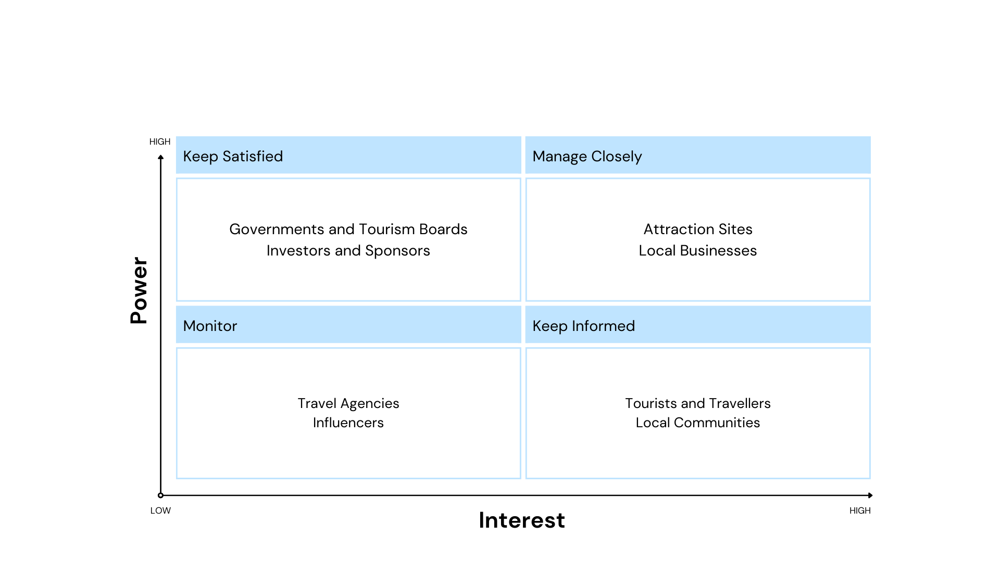 

 Figure 2: Power / Interest Grid 

## 6 Features

Features are distinct pieces of functionality that deliver value to users. They define what the software can do and are often used to plan and develop the product throughout its lifecycle.

| Feature ID | Feature Description|
|-----------|------------|
| F1         | Maintain an individual user bucket-list of attractions.          |        
| F2         | Display a map with available countries and available attractions in each country.       |        
| F3         | Maintain a community chatroom for attraction discoveries and user interactions.       |        
| F4         | Display advertisements.          |              
| F5         | Allow for premium features. (Let the user know when there are discounts for accommodation)        |        
| F6         | Keep track of the user's daily quiz score and their placement in the leaderboard. |        
| F7         | Reward the top competitors of the leaderboard with discounts, vouchers or free souvenirs.         |

Table 2: List of features that will be implemented for the final product.

## 7 Use Case Scenarios

Use case scenarios explain how a user works with a system to accomplish certain tasks or objectives. They
outline the steps needed to achieve a set objective and also help define system requirements, derived from
the user stories, which can be found in the Appendix B. The corresponding UML is illustrated in figure 3.

| Use Case ID | Use Case Description |
|--------------|------------|
| UC1          | Automatically display a map of available countries. |          
| UC2          | Automatically display a map of available attractions for the selected country. |          
| UC3          | Create a travelling plan for a given number of visiting days. |          
| UC4          | Create a shareable link of the travelling plan. |          
| UC5          | Allow users to cross-off visited attractions from the plan/bucket-list. |          
| UC6          | In the case of quizzes, the platform must offer a selection of questions, weighted in points. The summed points increase the user's daily score for the leaderboard. |          
| UC7          | Determine the user's reward based on their score. |          
| UC8          | Display advertisements for internal and external sponsors. |          
| UC9          | Display available discounts for internal and external sponsors. |                   
| UC10          | Process shop fee for earned souvenir by the user. |          
| UC11          | Maintain a hidden gem list of attractions. |      
| UC12          | List various restaurants or outdoors environments for nearby attractions. | 
| UC13          | (In case of premium) Process subscription fee for unlocking premium for the user's account. |          
| UC14          | (In case of premium) display a list of available accommodations. |          
| UC15          | (In case of premium) Remove advertisements and any sort of advertisement. |          

Table 3: List of use case scenarios that will be implemented for the final product.

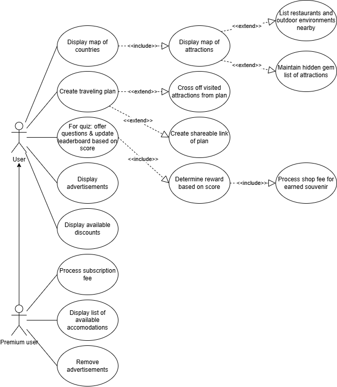

Figure 3: UML of the Use Case Scenarios

## 8 Requirements
Requirements are an essential part of understanding the needs and expectations of a system.

### 8.1 Functional Requirements
Table 4 shows the key functional requirements for the different features and modules.

| **Feature / Module**                      | **Key Functional Requirements**                                                                                                                                                         |
| ----------------------------------------- | --------------------------------------------------------------------------------------------------------------------------------------------------------------------------------------- |
| **Interactive Map & Discovery**           | Display an interactive map with countries and attractions.  Show recommended and community-contributed “hidden gems.”  Support zoom, filter, and search for easy exploration. |
| **Gamification & Leaderboards**           | Provide daily quizzes and challenges awarding points.  Maintain daily/weekly leaderboards with league promotions.  Offer rewards such as badges, vouchers, or discounts.                             |
| **Rewards & Marketplace**                 | Let users redeem points for travel deals or souvenirs.  Support secure payments for purchases and redemptions.  Display available rewards and partner offers.                 |
| **Sponsorships & Ads**                    | Show relevant sponsored ads and local offers.  Present promotions from partners non-intrusively.  Offer a premium ad-free subscription.                                       |
| **Premium Content Access**                | Unlock exclusive listings and advanced recommendations for premium users.  Manage secure subscription payments and entitlements.                                                  |
| **Local Communities & Businesses**        | Highlight local venues and small businesses.  Feature a “Hidden Gems” section curated by locals.  Allow verified community submissions and updates.                           |
| **Data Accuracy & Management**            | Verify data on maps, attractions, and offers regularly.  Maintain integrity and prevent unauthorized edits.                                                                       |
| **Communication & Interaction**           | Provide chat or forum features for user discussions.  Enable sharing of tips, experiences, and messages.                                                                          |
| **System Integration & Interoperability** | Connect all services via API Gateway and event-driven communication.  Ensure loose coupling, scalability, and secure data transfer.                                               |

Table 4: Functional Requirements

### 8.2 Non-Functional Requirements

Non-functional requirements aim to outline how a system should perform when completing its tasks, based on the system’s implementation. According to Sethi, R. (2023) [[11]](#11), non-functional requirements are better known as quality attributes as they describe the system's performance rather than its functionality. These specific attributes for TravelGo are further elaborated in the following section.

## 9 Quality Attributes
Quality attributes describe desirable properties of a system. For creating TravelGo we want to consider the following elements:

 - **Modularity**: Since the platform will have distributed deployment, TravelGo needs to use modules. Modularity is also important for parallel development and incrementally building. 

- **Performance**: TravelGo should not take a long time to respond, since this will annoy users and might make them not want to use the app. We also want the system to be able to take many requests at the same time.

- **Scalability**: At first, TravelGo will not have a lot of users. Of course we hope to increase this amount over time. Because of this, the architecture should be designed for growth.

- **Availability**: The system should be functioning correctly 24/7, since our users are in many different timezones, which means that the platform is always in use. We also want the platform to be partially available when users are not connected to the internet, which happens often when travelling.

- **Authentication**: Because users can buy a premium subscription that unlocks features, we need to be confirm their identity.

- **Integrity**: We need to be certain that all information on the platform is authentic, trustworthy and cannot be tampered with. It is also important that companies are paid for their services, and users get access to the additional features if they purchase the premium subscription.

- **Confidentiality**: Since we work with our users' and companies' personal data and have a chatroom functionality, we need to be certain that this sensitive data is not leaked or shared.

- **Adaptability**: It is important that our system is extensible, because we want to add new features as the platform becomes more successful. We also want our system to be modifiable, so that the implemented functionality can be changed if needed and we can remove less successful features.

- **Portability**: We want our platform to be available for all systems. If we make the app portable, we can save a lot of costs and effort.

The quality attributes that we primarily want to focus on are **scalability**, **modularity**, **confidentiality** and **integrity**.

### 9.1 Trade-offs
For the main quality attributes, there are some trade-offs that we should keep in mind while designing the system:

**Scalability vs Integrity**: TravelGo should be designed for growth. However, a large user-base all around the world could have an impact on integrity. For example, with more tourist attractions, it might be more difficult to assure that all the information on the platform is authentic and trustworthy.

**Scalability vs Performance**: We want TravelGo to have as many users as possible. Having said that, with more users the performance of the app might go down, especially since the users will be from all around the world. 

**Modularity vs Performance**: If the system is designed to be modular, the performance of the app might be worse. This is the case because the modules have to communicate with each other, which may cause delays.

**Confidentiality vs Modularity**: Confidentiality and modularity are both very important for most of our stakeholders. However, if the system is designed to be modular, it is harder to secure our system, since there will be multiple communication points between the modules.

### 9.2 Important quality attributes for stakeholders
Different stakeholders have different reasoning why certain quality attributes are the most important. This is shown in table 5.

| Quality Attribute | Expectation                                                                                                                                               | Stakeholders                                                                                    |
|-------------------|-----------------------------------------------------------------------------------------------------------------------------------------------------------|-------------------------------------------------------------------------------------------------|
| Scalability       | - System should be able to scale to support peak tourist seasons                                                                                          | - Governments & Tourism Boards                                                                  |
|                   | - The system should be capable of displaying all attraction sites                                                                                         | - Attraction Sites                                                                              |
|                   | - System should recommend my business when planning a trip without being influenced by the user's current location                                        | - Local Businesses - Investors & Sponsors                                                    |
|                   | - Communities would want to grow without the app slowing down, from a handful of members to thousands                                                     | - Travel Communities & Influencers                                                              |
|                   | - System should scale for multiple users exploring community resources                                                                                    | - Local Communities                                                                             |
|                   | - System should be fast and easily understandable even when multiple users are utilising the app or when multiple leagues are run for different countries | - Tourists and Travellers                                                                       |
| Modularity        | - System should include the attraction site in all features, new and old                                                                                  | - Attraction Sites                                                                              |
|                   | - System should be able to integrate new features seamlessly                                                                                              | - Travel Communities & Influencers - Governments & Tourism Boards - Local Communities     |
| Integrity         | - System should be reliable such that users can trust it and companies want to collaborate with it                                                        | - Governments & Tourism Boards                                                                  |
|                   | - If I pay for a partnership, advertisement, subscription or positive publicity, I must get what I paid for                                              | - Investors & Sponsors                                                                          |
|                   | - The system should offer compensation for my service before advertising on the platform                                                                  | - Local Businesses - Attraction Sites                                                        |
|                   | -  All the information on the platform must be authentic and trustworthy                                                                                  | - Travel Communities & Influencers - Tourists and Travellers - Local Communities          |
|                   | - System should provide advertised features if the premium subscription is paid for                                                                       | - Tourists and Travellers                                                                       |
|                   | - System should reward a winner from leagues. In the case of equal scores, alternative solutions must be implemented                                      | - Tourists and Travellers                                                                       |
| Confidentiality   | - Sensitive data should not be leaked or shared                                                                                                           | - Investors & Sponsors - Attraction Sites - Local Businesses - Tourists and Travellers |

Table 5: Quality Attributes with respect to Stakeholders needs 

## 10 Architecture Design
Now that the context of the system has been defined, the next step is to determine the architectural design. This will be based on our main quality attributes: scalability, modularity, integrity and confidentiality.

### 10.1 Architectural Styles
To make sure that the system meets its most important quality attributes, an appropriate architectural style has to be selected. We will consider the following architectures: the monolithic architecture, the microkernel architecture, the serverless architecture and the microservices architecture.

#### 10.1.1 Monolithic Architecture
The monolithic architecture [[1]](#1) mainly has disadvantages for our system. For two of our most important quality attributes, modularity and scalability, the monolithic architecture is a poor choice. 
In terms of modularity, The system cannot be distributed, and deployment in the cloud is very expensive. Since our system has many functionalities, this is not ideal, because if one function does not work all of the other functionalities do not work either. Additionally, if you change one thing in the monolith, everything has to be rebuild. Since there will be many changes on the platform, this is would be difficult. Tourist attractions will be added and removed all the time. Regarding scalability, the existing code cannot be reused. This means that if we want to use part of our existing code, we would have to reuse all of the code of our monolith, even the parts that we do not need.

 However, the monolithic architecture has one advantage: it might be easier to secure, since it has fewer communication points. This could have a positive impact on the confidentiality and integrity of the system.

#### 10.1.2 Microkernel Architecture

Microkernel architecture will provide the platform with a lightweight and stable core while allowing the features to be added as independent plug-ins. This modularity will make it easier to expand and maintain the system, ensuring that failures in one module do not affect the entire platform. However, the platform relies heavily on high-performance interactions with external systems like map services and tourism boards and live community interaction through chats and posts. A microkernel has a high performance overhead due to the constant communication between the core and plug-ins, which could degrade user experience during peak usage. Additionally, it also increases the development time and cost of designing and maintaining interfaces between the kernel and multiple modules.

#### 10.1.3 Serverless Architecture

Serverless architecture enables the platform to be scaled automatically based on user demand and reduces the need for managing servers by developer since cloud providers manage it [[5]](#5). This architecture allows platforms to simplify deployment and improves operational efficiency. However, TravelGo would heavily rely on real-time interactions such as leaderboards, competitive quizzes, and user engagement based on location. Therefore, even though serverless systems are highly scalable and stateless by nature, it can lead to more overhead in terms of response time and cost when handling large number of complex processes. Furthermore, it implies less control on the server side which could breach confidentiality and security protocols.

#### 10.1.4 Microservices Architecture
With respect to scalability, TravelGo will serve a diverse user base with travelers from around the world. Microservices can be deployed across multiple regions, closer to where users are, which reduces latency and ensures a seamless experience globally. Since each service can scale independently, TravelGo can easily handle spikes in usage,  for example, scaling the chatroom service during travel seasons without affecting payments or recommendations.

Regarding modularity, TravelGo offers a variety of features like community interactions, cultural content, side quests,  and plans to add even more in the future. Microservices naturally support modularity by dividing the system into small, loosely coupled services, each built around a specific business capability. This allows TravelGo to implement, test, and deploy new features independently, without slowing down the rest of the system. For instance, a new “local quiz” module could be rolled out without touching the existing leaderboard or chat functionality.

Lastly, as TravelGo collects sensitive personal data such as names, payment details, and location information, integrity and security are critical. Microservices help here by isolating services and containing failures. If one service is compromised, others remain unaffected, protecting the majority of user data. While microservices do increase the number of potential entry points into the system, these risks can be managed with event-driven communication, strong authentication, and encryption. This ensures that TravelGo maintains user trust by preserving data security and system reliability.  

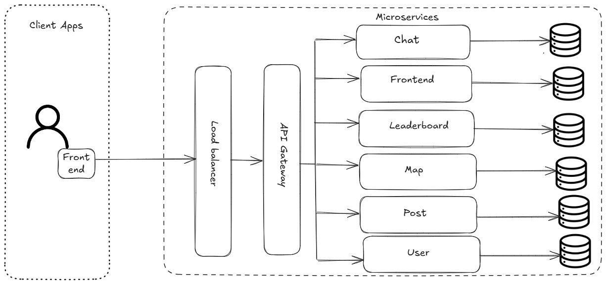

Figure 4: Microservices architecture of the system

#### 10.1.5 Trade-Off Analysis for Architectural Styles
Although all of the four architectural styles have their disadvantages and advantages, as shown in Table 6, a single approach must be selected. The monolithic architecture is the least suitable for our system, since it has significant disadvantages in terms of modularity and scalability. The microkernel and serverless architectures are both reasonable options, however they have less important advantages and more disadvantages compared to the microservice architecture. 

The microservice architecture has advantages for all of our main quality attributes. The only disadvantage is that it increases the number of potential entry points into the system, which can be managed using event-driven communication. Therefore, the **microservice architecture** is the most advantageous for our system.

|               | Advantages                                                                                                                                               | Disadvantages                                                                                                                                                                                                               |
|---------------|----------------------------------------------------------------------------------------------------------------------------------------------------------|-----------------------------------------------------------------------------------------------------------------------------------------------------------------------------------------------------------------------------|
| Monolithic      | - Easier to secure                                                                                                                                       | - System cannot be distributed - Deployment in cloud is expensive - If one thing does not work the rest does not either - If one thing is changed everything has to be rebuild - Existing code cannot be reused |
| Microkernel   | - Allows features to be added as plug-ins - Failures in one module does not affect others                                                             | - High performance overhead - Increases development time & cost of designing and maintaining                                                                                                                             |
| Serverless    | - Automatic scaling - Simplifies deployment - Improves operational efficiency                                                                    | - More overhead in response time and cost - Less control on server side                                                                                                                                                  |
| Microservices | - Each service can scale independently - Features can be implemented, tested and deployed independently - Isolates services and contains failures | - Number of potential entry points into the system increases                                                                                                                                                                |

Table 6: Advantages and disadvantages of the architectural styles 

### 10.2 Architectural & Design Patterns

Considering the proposed architecture and the proposed architectural structure of the TravelGo system, various architectural patterns would be suitable. In the following subsections we present the primary patterns that were considered with respect to the most important quality attributes and assess their suitability for our system. Moreover, an overview of additional patterns for the implementation of the system can be found in Appendix C.

#### 10.2.1 Event Driven
Event-driven communication allows TravelGo to handle a large and diverse user base more efficiently. Instead of services constantly calling each other through direct APIs, they publish and subscribe to events via a broker. This highlights scalability as it reduces coupling and lets multiple services consume the same event without adding system strain. For instance, when a QuestCompleted event is published, the Leaderboard Service, Notification Service can all react independently. This enables TravelGo to scale individual services as demand grows, ensuring smooth performance during travel season spikes or viral content moments.

Furthermore, TravelGo has distinct features such as the community chatroom, cultural side quests and league based competition, that all evolve at different speeds. Therefore, event-driven design supports loose coupling, meaning each service can be developed, deployed, and maintained independently which supports modularity. Adding new features is straightforward, a new service just subscribes to relevant events without disrupting existing ones. Introducing a new module only requires subscribing to its related events, avoiding changes to other services.

Finally, with respect to integrity, events provide a structured, controlled way of sharing only the necessary data between services, improving data integrity and security. Sensitive data can be filtered at the broker, while services only receive the minimum required data needed, for instance, user IDs rather than full profiles. Moreover, event logs create an auditable trail of what happened and when, which strengthens TravelGo’s reliability and accountability. If inconsistencies like leaderboard manipulation arise, events can be traced back to verify the source of truth.

#### 10.2.2 SAGA Pattern
Although SAGA is a widely used design pattern for microservices, we do not believe it to be advantageous for our system. There are two main reasons for this. First of all, SAGA might cause increased latency, since services have to coordinate with each other. Because of this, the performance of our system might decrease.
Second of all, SAGA is difficult to implement, and hard to debug. We do not believe that the advantages of SAGA outweigh these disadvantages.

#### 10.2.3 API Gateway

The API Gateway acts as the central entry point for all client requests. Instead of the frontend or mobile application communicating directly with each individual microservice (like posts, chat, map, or leaderboard), all interactions first go through the API Gateway. It routes these requests to the correct service, aggregates data when needed, and returns a unified response to the user.

This design greatly simplifies communication between the frontend and backend systems. For example, when a traveller views the map, submits a post, or checks the leaderboard, the frontend sends requests only to the gateway. The gateway then coordinates with the relevant microservices such as the Map Service, Post Service, and Leaderboard Service, and compiles the response efficiently.

The API Gateway helps TravelGo scale horizontally by decoupling client interactions from the underlying microservices. Each service can be deployed, replicated, and scaled independently without affecting others. By isolating each service behind the API Gateway, TravelGo’s architecture remains modular. All communication passes through the gateway as it is the central control point. The gateway can manage user authentication, enforce authorisation, and apply HTTPS encryption to secure data in transit. This ensures that sensitive user information remains protected and that only authorised users can access specific features.

#### 10.2.4 Retry Pattern

The Retry Pattern is a mechanism that automatically reattempts failed operations after a short delay, sometimes successfully helping the systems recover from temporary issues such as network timeouts. It would be suitable for our system as it will likely face multiple network or connectivity issues or brief spikes from the third-party APIs during high network traffic. Therefore, simply retrying after a short delay would often lead to the service succeeding in these situations.

To conclude, the architecture that would be the best fit for TravelGo is a microservices architecture with an Event-Driven communication pattern including an API Gateway.

## 11 System Decomposition
In order to attain modularity, scalability, and ease of maintenance, TravelGo is broken down into its component subsystems and modules using system decomposition. This hierarchical breakdown reflects the microservices based architecture adopted by the platform, emphasising loose coupling between services and clear separation of functionalities. Each level of decomposition corresponds to increasing detail, from the overall system to specific services and functional modules.

### 11.1 Context View

The System Context Diagram highlights TravelGo’s role within its environment. It shows the platform as the central system interacting with travellers, attraction owners, and several external systems such as map providers, tourism boards, influencers, and competitors. The diagram illustrates key flows of information (e.g. travellers providing personal information, owners submitting attractions, the platform requesting maps) and helps define clear system boundaries and dependencies within a modular microservices framework.

The system relies on event-driven communication (implemented via Kafka) and an API Gateway that serves as the single entry point for all client requests.

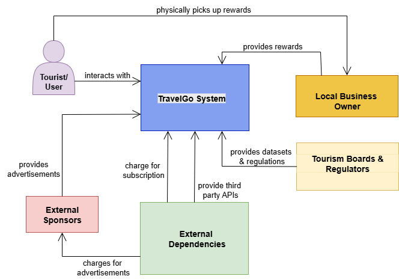

Figure 5: Context Diagram

### 11.2 Container View

This next view depicts all subsystems from the context view further elaborated into containers. As you can see in Figure 6 below, the TravelGo System, Local Business Owners, Tourism Boards and External Dependencies now showcase more details about their inner workings.

| **Subsystem**           | **Description**                                                                                               | **Interfaces / Dependencies**            |
| ----------------------- | ------------------------------------------------------------------------------------------------------------- | ---------------------------------------- |
| **Frontend Service**    | Provides the interface for users to view maps, make posts, view leaderboards, and chat.                   | Communicates with API Gateway via REST  |
| **API Gateway**         | Manages routing, authentication, and load balancing between clients and backend microservices.                | Interfaces with all backend services   |
| **User Service**        | Manages user profiles, authentication, and subscriptions.                                                     | API Gateway, Database                 |
| **Post Service**        | Handles posts, experiences, and attractions shared by travellers.                                              | Kafka  |
| **Leaderboard Service** | Calculates and updates user scores based on post activity.                                          | Kafka, Post Service |
| **Chat Service**        | Enables real-time user communication and community discussions.                                               | Websocket API                          |
| **Map Service**         | Integrates with third-party map providers. Displays locations and attractions. | API Gateway, External APIs             |
| **Advertisement Service**         | Integrates with third-party providers to display advertisements. | All microservices             |
| **Kafka**   | Ensures asynchronous message delivery between services for decoupled scalability.                             | All microservices                      |
| **Database Layer**      | Stores structured and unstructured platform data (user profiles, posts, scores).                        | All microservices                      |

Table 7: Subsystem Decomposition 

The system’s core container is the Application, which interacts with the Tourist and utilises internal databases to manage user data, as well as external databases to interact with the Tourism Boards. Furthermore, the connection with the External Dependencies is carried out through 2 connections between the Payment System for processing user subscription and the Third-Party Map API. Lastly, the Local Businesses contain the Rewards and the functional relation is presented.

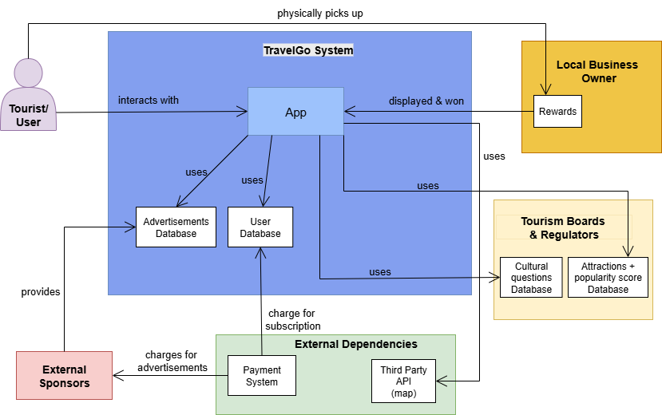

 Figure 6: Container Diagram

### 11.3 Component View

Each subsystem is further decomposed into logical components. Each service runs independently within its own Docker container, exposing RESTful APIs through the API Gateway and communicating asynchronously using Kafka topics when necessary. Each service's major components are defined further in appendix D.

As can be seen from the Figure 7 below, the system's Application will contain the presented components.

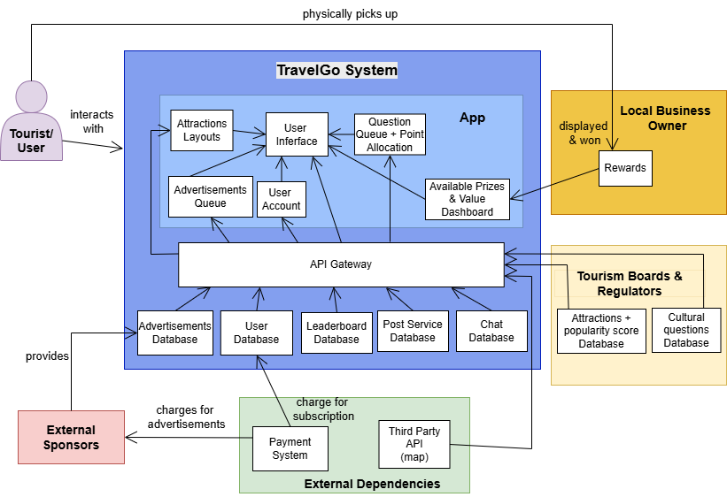

 Figure 7: Component Diagram

### 11.4 Class View

The class view represents the structural relationships and interactions between the services of TravelGo. It comprises five main classes: user, post, leaderboard, chat, and map. Each class is defined with relevant fields, methods, and return types, as illustrated in Figure 8 below. The leaderboard class derives its data from both the user and post classes to compute rankings. The post class interacts with the user and map classes to associate posts with specific users and locations or attractions. Similarly, the chat class depends on the user class to manage message exchanges and identify message ownership. This structure ensures modularity, clarity, and efficient data flow across different components of the system.

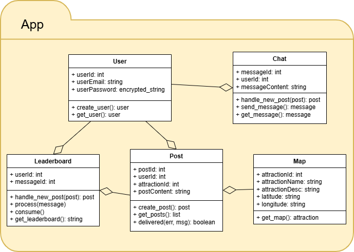

 Figure 8: Class Diagram

### 11.5 Deployment View
At runtime, TravelGo operates within a Docker-based containerised environment. Each service (User, Post, Map, etc.) runs in its own container, orchestrated by Docker Compose.
Kafka runs as a separate container for event streaming, while the API Gateway and Frontend are load-balanced to support scalability testing with Locust.

Deployment Components:
- Client (Web/Mobile) → Load Balancer → API Gateway → Microservices → Kafka → Database.
- Containers communicate via REST or asynchronous event messages.
- Scaling is achieved by increasing the number of service containers dynamically based on load.

## 12 Cloud Dependency
Given TravelGo’s global reach and microservices-based architecture, deploying the system on the cloud offers clear benefits in terms of scalability, modularity, and integrity than having servers on premise. Cloud infrastructure allows hosting services closer to users through geographically distributed data centers, ensuring low latency and consistent performance even during high-traffic periods.

To determine the most suitable cloud environment, three primary options were evaluated below:

| **Cloud Model**                    | **Advantages**                                                            | **Disadvantages**                                               | **Suitability for TravelGo**                                           |
| ---------------------------------- | ------------------------------------------------------------------------- | --------------------------------------------------------------- | ---------------------------------------------------------------------- |
| **Public Cloud** | Cost-efficient, elastic scaling, minimal maintenance, pay-as-you-go model | Lower control over security and compliance                      | Ideal for early-stage deployment; fast, flexible, and cost-effective |
| **Private Cloud**                  | Enhanced security, privacy, and control                                   | High setup cost, limited scalability, ongoing maintenance needs | Suitable for sensitive data and compliance-heavy operations         |
| **Hybrid Cloud**                   | Combines scalability of public cloud with control of private cloud        | Complex management, higher cost, potential latency issues       | Long-term strategy — balance flexibility with data protection       |

 Table 8: Cloud Comparison

 
We begin with Public Cloud for cost efficiency and rapid scaling, then transition toward a Hybrid Cloud as the user base grows and security requirements increase.
  

TravelGo would primarily use Platform as a Service (PaaS) or container-based solutions such as AWS ECS or Google Kubernetes Engine, enabling independent deployment and scaling of microservices. Serverless options like AWS Lambda or Google Cloud Functions can handle event-driven features (e.g., notifications or leaderboard updates), offering efficient scalability for unpredictable workloads.
  

Cloud deployment reinforces TravelGo’s key quality attributes:

Scalability: Auto-scaling dynamically adjusts resources to user demand.  
Modularity: Each microservice is containerized and independently managed.  
Integrity: Built-in tools like encryption, IAM, and DDoS protection enhance data security and reliability.

However, potential challenges include vendor lock-in, data residency compliance (e.g., GDPR), and management complexity in distributed environments. These risks can be mitigated using cloud-agnostic tools (Docker, Kubernetes) and region-specific deployments.

## 13 Open Source Components
To save on time, cost and effort, we will make use of open source software. This does come with some risks: open source software might lead to compatibility issues, lack of support and potential security vulnerabilities. To mitigate these risks, all open source software must be carefully evaluated before usage. In some cases, open source tools might have to be adapted to fit our system better.

### 13.1 Interactive Map
The map is one of the core features which users will utilise to explore attractions, and post experiences. It impacts the performance, flexibility, licensing cost, and integration ease of the system.

| **Criteria** | **Leaflet** | **OpenStreetMap (OSM)** | **Google Maps** |
|---------------|-------------|--------------------------|-----------------|
| **Type** | JavaScript mapping library | Geospatial data provider | Full mapping platform (API + data) |
| **Cost** | Free & open-source | Free | Paid after free tier |
| **Map Data Source** | Customisable | Own map data | Proprietary data |
| **Customisation** | Extremely high | Moderate | Limited |
| **Integration Complexity** | Low | Medium | High |
| **Offline Support** | Partial (with local tiles or caching) | Yes, if tiles are self-hosted | Limited |
| **Performance** | Very fast | Depends on rendering library | Fast |
| **License Restrictions** | None for library itself; tile servers must respect provider terms | Requires attribution | Strict API usage terms, cannot self-host |
| **Privacy** | Self-hosted; no tracking | Fully open data | Google owns map data and telemetry |
| **Deployment** | Very easy; no API keys or billing setup | Needs rendering layer | Requires Google API key and cloud project setup |

Table 9: Comparative Analysis for Interactive Maps 
 

Based on the table, Leaflet was chosen for the mapping engine with OpenStreetMap dataset as it is open-source and cost free [[13]](#13). It has no licensing or billing constraints and can be embedded directly into the existing client-side module. Moreover, as it implements a plugin ecosystem, TravelGo’s concept of showing hidden gems and user posts can be rendered in custom layers. By pairing Leaflet with OpenStreetMap tiles, the system achieves a completely open-source mapping stack [[14]](#14). This preserves data ownership and allows for migration to self-hosted tiles or private map layers at a later stage. This ensures user privacy and local compliance. Leaflet can cache tiles locally or use self-hosted tile servers, enabling limited offline functionality, which aligns with the future goal of supporting travelers in low-connectivity areas.

### 13.2 Locust - Load Testing Tool
Locust was selected as the primary load testing tool for TravelGo because of its flexibility, simplicity, and seamless integration with our microservices and Docker-based architecture. Written in Python, Locust allows test scenarios to be defined as plain Python code, which made it easy to simulate realistic user interactions with TravelGo’s REST APIs, such as creating posts without requiring complex scripting or configuration.

Compared to other tools like Apache JMeter or Gatling, Locust offered several practical advantages for our setup, as shown in Table 11. It is lightweight, open-source, and natively supports distributed load testing, allowing us to simulate thousands of concurrent users through multiple worker instances if needed. The web-based dashboard provided real-time metrics on request rates, failures, and latency, making it ideal for demonstrating system scalability visually during experimentation.

Furthermore, Locust integrates smoothly with Docker Compose, enabling it to run as a separate container within the same network as other services. This simplified deployment and ensured consistent testing conditions without additional setup. Overall, Locust proved to be the most efficient and developer-friendly choice for validating the scalability and performance of TravelGo’s microservices.

| **Criteria** | **Locust** | **Apache Jmeter** | **Gatling** |
|---------------|-------------|--------------------------|-----------------|
| **Language/Framework** | Python | Java | Scala |
| **Advantages** | Lightweight, integrates well with docker and microservices | Extensive protocol support and strong analytics | Good for continuous integration  |
| **Disadvantages** | Comparatively less advanced reporting | Heavier setup, complex scripting | Requires scala knowledge |
| **Suitability for TravelGo** | Simple, scalable and developer friendly | Not very suitable for containerised setup | Less flexible |

Table 10: Comparative Analysis for load testing tools 

### 13.3 Nginx - Load balancer
Nginx was chosen as a load balancer for TravelGo's system architecture due to its simplicity and lightweight footprint. It fit well with the system's docker based microservices architecture. There are more advanced alternatives available like HAProxy or Traefik which offer dynamic service discovery. For the PoC, we implemented Nginx as it was sufficient. Its easier integration enabled us to implement and prove horizontal scaling without adding unnecessary complexity.

### 13.4 Apache Kafka - Event Streaming Platform
The choice of an event streaming platform is an important decision that impacts system performance, scalability and reliability. In Table 11, multiple options are compared based on their advantages, disadvantages and suitability.

|                          | Kafka                                                                                          | RabbitMQ                                                                               | Amazon Kinesis                                                              | RedPanda                                                           |
|--------------------------|------------------------------------------------------------------------------------------------|----------------------------------------------------------------------------------------|-----------------------------------------------------------------------------|--------------------------------------------------------------------|
| Advantages               | High performance, fault tolerance and durability                                               | Supports multiple messaging protocols, reliable messaging and flexible routing options | Deep integration with AWS ecosystem, high scalability and strong durability | Simplicity, low latency, strong durability, ease of use            |
| Disadvantages            | Complex to setup, configure and manage                                                         | Limited scalability                                                                    | Vendor lock-in with AWS, can become costly                                  | New to the market                                                  |
| Best for                 | Large-scale, real-time data streaming and event-driven architectures                           | Small-scale projects or environments requiring messaging-oriented middleware           | AWS-based projects, large-scale real-time data processing                   | Projects with high performance and low latency                     |
| Suitability for TravelGo | Very suitable, as it enables scalable and reliable event-driven communication between services | Not ideal, because TravelGo requires high scalability                                  | Not ideal, as TravelGo is not AWS-based and it can become costly            | Good option, however small community since it is new to the market |

Table 11: Comparative analysis for event streaming platforms 

Based on Table 11, Kafka is the best option for TravelGo, since it offers high performance, fault tolerance, durability and great scalability. RabbitMQ and Amazon Kinesis have the most significant disadvantages for TravelGo. RabbitMQ lacks scalability, and Amazon Kinesis has potential concerns due to cost and the vendor lock-in. While RedPanda would be a good alternative, compared to Kafka it has a smaller community and is relatively new to the market which can result in less support and maturity.

### 13.5 Docker Implementation

Docker is a one of the most popular open-source containerisation platforms that allows developers to package applications with all their dependencies into portable, lightweight containers. Since TravelGo implements an event-driven approach in a microservices architecture, multiple services need to work together, and Docker offers a high degree of flexibility and versatility by ensuring cross-platform compatibility and easy control over container versions [[17]](#17). However, using Docker can also raise concerns about system security, as it relies heavily on a daemon [[17]](#17) to run all containers under a centralised background process. This can introduce security vulnerabilities related to the daemon's root access, alongside concerns about high memory and CPU usage rates. Therefore, alternatives such as Podman and Buildah were created to overcome these drawbacks. In this sense, Podman removes the security vulnerability by allowing users to run containers themselves without the daemon, which is a safer approach [[17]](#17). On the other hand, Buildah is used to create containers without a background service, focusing on container images, and thus offers more control over the building process and it is lighter and more secure [[16]](#16). Despite this, neither Podman and Buildah are optimal for TravelGo, as they further imply additional complexity for creating and managing containers. This fragmentation could potentially slow down the platform's response to changes.

Other alternatives such as Linux Container Daemon (LXD) and Vagrant are also incompatible for TravelGo. This is because LXD uses entire system environments instead of containers, making the entire operation slower and unsuitable for a microservice architecture [[18]](#18), while Vagrant relies on virtual machines, which are resource intensive [[17]](#17). Therefore, Docker remains the best option for TravelGo, due to its ease of use and operation, which are perfect for TravelGo's design philosophy.   

## 14 Proof of Concept

The development of the proof of concept demonstrates the technical feasibility of the platform’s microservices-based architecture and to validate its core design principles; scalability, modularity, and reliability. The PoC serves as a minimal yet functional version of the TravelGo system, simulating the interaction between key components such as the map service, post service, leaderboard service, and chat service, all coordinated through an API Gateway and an event-driven communication model [[12]](#12).

The implementation uses Python and Flask to represent each microservice, where every service runs independently on a separate port. This allows each module to be developed, deployed, and scaled independently; a direct demonstration of modularity and scalability. For instance, the post service handles user-generated travel experiences and attractions, while the leaderboard service listens for new posts via Kafka to dynamically update user scores.

At the center of the architecture lies the API Gateway which receives requests from the load balancer. It routes requests to the relevant services and aggregates responses where necessary. This setup not only simplifies communication between the frontend and backend but also improves system integrity by controlling and monitoring access to each microservice. The event-driven communication pattern, implemented through Kafka, allows services to communicate asynchronously. For example, when a new post is created, an event is broadcast to other services (the leaderboard), which can respond to it without being tightly coupled to the post service. This design ensures that each component can evolve or scale independently without disrupting the rest of the system.

The PoC includes a simple frontend interface built with Flask templates. The homepage displays an interactive map from the map service, while the posts, leaderboard, and chat pages represent user interaction points. Although simplified, this frontend demonstrates how user actions trigger backend operations and inter-service communication. The structure follows the directory layout of real-world modular systems, ensuring future compatibility with more advanced frameworks or containerised deployments (e.g., using Kubernetes).

### 14.1 Experiments & Results
The following section will discuss the experiments and results conducted by the current PoC.

#### 14.1.1 Event-driven Communication
To implement event-driven communication, we integrated Apache Kafka. Specifically, our goal was to have the leaderboard update automatically whenever a user creates a new post through the post service. 

The post service acts as a Kafka producer and publishes an event to the new post topic whenever a new post is created. The leaderboard service is implemented as the Kafka consumer, which is subscribed to this topic and listens for incoming events. Every time a user makes a new post, the post service publishes an event to Kafka. The leaderboard consumes this event and updates the leaderboard accordingly.

To test this, we simply create a new post for a specific user id. After the event is published and consumed, the user gains ten points on the leaderboard. Creating additional posts results in further point increments, confirming that the event-driven communication between the two services works as expected. The results are shown in Figure 9.

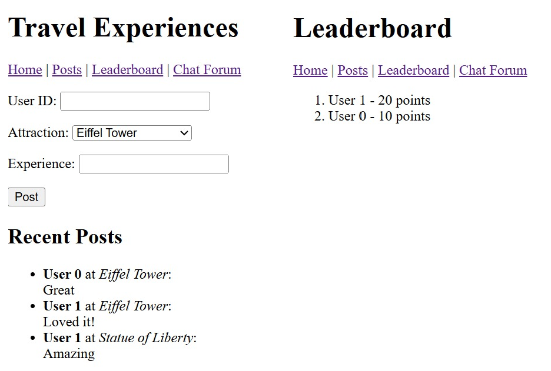

 Figure 9: The leaderboard gets updated after new posts

#### 14.1.2 Proving Modularity

#### 14.1.3 Proving Scalability
To evaluate the scalability of the TravelGo system, we conduct load testing using Locust, an open-source tool for simulating user traffic. The objective of this experiment is to verify that the chat service can handle increasing user loads without significant failures or degradation in response time.

In the experiment, we configure Locust to simulate multiple concurrent users sending chat messages through the API Gateway. The test environment consists of all microservices deployed via Docker Compose, ensuring realistic inter-service communication. We observe key performance indicators such as request rate (RPS), failure rate, and average response time as the number of simulated users increased.

We initially deploy multiple API Gateway replicas and configured NGINX as a load balancer for these replicas. When only a single instance of the chat service was active, response times increases and occasional request failures occur as the number of concurrent users grow. To address this, we deploy multiple replicas of these services to implement horizontal scaling and route requests through an NGINX load balancer. NGINX distributes incoming requests evenly across available instances, preventing any single container from becoming a bottleneck.

After scaling the chat service, Locust results showed significant performance improvements: the average response time decreased and throughput (RPS) increased even as the number of simulated users rose. These results demonstrate that TravelGo’s microservices-based design supports horizontal scaling at the service level, allowing individual components such as the chat service to handle higher loads efficiently without affecting others.

These results demonstrate that TravelGo’s microservices architecture supports elastic scalability: services can be scaled independently based on demand without affecting overall system performance. This confirms that the chat service can efficiently handle higher loads, maintaining system integrity and user experience.Future tests can extend this setup to other services, validating end-to-end scalability across the entire TravelGo ecosystem. The results are shown in Figure 10.

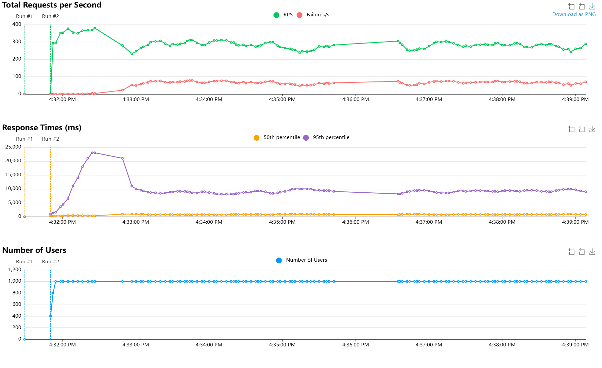

 Figure 10: Locust load-test experiment results

## 14 Revenue Model

In order to ensure long-term success for a platform, a sustainable revenue model is essential. The presented system would blend reality exploration with competitive gaming, meaning it can attract tourism-focused partnerships, as well as game-industry monetisation.

### 14.1 Revenue Streams

The platform can be supported by income from multiple combined streams presented in the table below.

| Revenue Stream   | Implementation Details | Advantages| Challenges |
| -------------------------------- |-------- | --------- | ----------|
| Free Content / Subscription | Free tier with core features; premium tier unlocks exclusive content | Predictable recurring income; encourages retention   | Requires adequate premium features to justify the cost |
| In-App Purchases  | Cosmetic items, location-based boosts, hints, custom avatars | Transaction-based revenue resulting in immediate revenue from passionate users   | High risk of warping user perception and turning the platform into "pay-to-win" if not balanced |
| Advertising & Sponsorships | Through advertisements, local businesses sponsor the discounts, souvenirs and/or events | Transaction-based revenue for non-premium users; Immediate income from sponsors | The advertising cannot be excessive in order to not degrade user experience   |

Table 12: List of viable revenue streams.

Furthermore, since the platform is newly developed, the revenue model should be implemented in progressive stages.
At launch, most of the platform content should remain free to access to build the user base. Additionally, basic in-app purchases for cosmetic reasons can be included. During the next stage, the relation with local business owners would be established, and the platform would begin featuring sponsored restaurants and souvenir shops, as well as custom maps and affiliation with tourist companies in the premium version. Lastly, the final stage could envision production of large-scale events, partnerships with museums from bigger cities and metropolises and potential merchandise sales.

### 14.2 Risks and Considerations

- User Experience: Excessive monetisation risks pushing tourists away, therefore, the free version must remain engaging.
- Fairness: Competitive features must avoid "pay-to-win" dynamics.
- Scalability: Each additional revenue stream increases system complexity. As such, the platform should be built in a modular way so features can be added independently without interfering with existing ones.

## 15 Roadmap
The stages in which the proposed system will be implemented can be seen in the roadmap below.

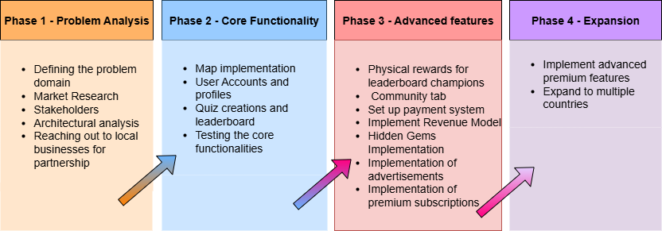

Figure 11: Roadmap

## 16 Future scope
Due to time constraints, the primary focus of this report was on setting up the system architecture to support the main features of TravelGo. The PoC was therefore limited in scope, since it does not include the features exclusive to our premium subscribers, such as the removal of advertisements. Although we designed the architecture with these extensions in mind, their implications will be addressed in future development. This should not come with significant challenges, as the architecture follows a modular approach.

## Bibliography
<a id="1">[1]</a>
Pautasso, C. (2020). Software Architecture: visual lecture notes. LeanPub. https://leanpub.com/software-architecture/ (Date Accessed - September 2025)
 <a id="2">[2]</a>
Alčaković, S., Pavlović, D., & Popesku, J. (2017). Millennials and gamification: A model proposal for gamification application in tourism destination. Marketing, 48(4), 207–214. https://doi.org/10.5937/markt1704207a (Date Accessed - September 2025)
 <a id="3">[3]</a>
Gen Z Travel Trends: Statistics, Insights and what it all means for the industry [2025]. (n.d.). Atlys. https://www.atlys.com/blog/gen-z-travel-trends (Date Accessed - September 2025)
 <a id="4">[4]</a> 
Pitrelli, M. (2023, March 27). More millennials are turning 40 — and they’re changing travel as we know it. CNBC. https://www.cnbc.com/2023/03/27/millennials-are-turning-40-and-theyre-changing-travel-as-we-know-it.html (Date Accessed - September 2025)
 <a id="5">[5]</a>
Artug, E., & Fateh, D. (2025, March 28). Serverless and microservices: A tale of two architectures. Contentful. https://www.contentful.com/blog/serverless-vs-microservices/ (Date Accessed - October 2025)
 <a id="6">[6]</a>
Types of Cloud Computing. AWS. https://aws.amazon.com/types-of-cloud-computing/ (Date Accessed - September 2025)
 <a id="7">[7]</a>
Cody Slingerland. (2023). What Is Cloud Scalability? Benefits And Tips For Every Organization. CloudZero. https://www.cloudzero.com/blog/cloud-scalability/ (Date Accessed - October 2025)
 <a id="8">[8]</a>
Chrystal R. China, & Michael Goodwin (2025). IaaS, PaaS, SaaS: What's the difference? IBM. https://www.ibm.com/think/topics/iaas-paas-saas (Date Accessed - September 2025)
 <a id="9">[9]</a>
Brown, S. (n.d.). The C4 model for visualising software architecture. C4 Model. Retrieved October 12, 2025, from https://c4model.com/ (Date Accessed - October 2025)
 <a id="10">[10]</a>
Ahmad, A. (2025, August 23). 19 Essential Microservices Patterns for System Design Interviews. Design Gurus. https://www.designgurus.io/blog/19-essential-microservices-patterns-for-system-design-interviews?gad_source=1&gad_campaignid=21052024757&gbraid=0AAAAADME9yrt3rLA-YSrKYswgzdQyBX6D&gclid=Cj0KCQjwovPGBhDxARIsAFhgkwRavr_Fn1z55RbDBcbpqNeaZ_L5WuzKZd0gBhH05Vf0RLmLTqh8ahUaAkCBEALw_wcB  (Date Accessed - October 2025)
 <a id="11">[11]</a>
Sethi, R. (2022). 3.1.3 Kinds of Requirements [ISBN 9781316511947]. In Software Engineering: Basic Principles and Best Practices. Cambridge University Press (1st ed., pp. 181-185).
 <a id="12">[12]</a>
Singh, B. (2024, October 20). Building a Simple Microservices Architecture with Python: A Step-by-Step Guide. Medium. https://medium.com/@bittusinghtech/building-a-simple-microservices-architecture-with-python-a-step-by-step-guide-c41da2cd4631 (Date Accessed - September 2025)
 <a id="13">[13]</a>
Temprano, V. G. (2017, January 18). Google Maps API or Leaflet: What's Best for your Project? Codementor. https://www.codementor.io/@victorgerardtemprano/google-maps-api-or-leaflet--what-s-best-for-your-project-faaev60vm (Date Accessed - October 2025)
 <a id="14">[14]</a>
I-Finity Associates Ltd. (n.d.). OpenStreetMap vs Google Maps | I-Finity. https://www.i-finity.co.uk/articles/openstreetmap-vs-google-maps (Date Accessed - October 2025)
 <a id="15">[15]</a>
Public Cloud vs Private Cloud vs Hybrid Cloud. (2025, July 23). GeeksforGeeks. https://www.geeksforgeeks.org/devops/public-cloud-vs-private-cloud-vs-hybrid-cloud/ (Date Accessed - October 2025)
 <a id="16">[16]</a>
Minimal Develops. (2024, August 15). Buildah Vs Docker. Medium. https://minimaldevops.com/buildah-and-docker-are-both-tools-for-building-container-images-but-they-have-some-key-differences-a3530b923be0 (Date Accessed - October 2025)
 <a id="17">[17]</a>
Top 10 Docker Alternatives For Software Developers. (2025, July 23). GeeksforGeeks. https://www.geeksforgeeks.org/blogs/docker-alternatives/ (Date Accessed - October 2025)
 <a id="18">[18]</a>
Perlow, J. (2024, June 13). LXC vs. Docker: Which One Should You Use? Docker. https://www.docker.com/blog/lxc-vs-docker/ (Date Accessed - October 2025)